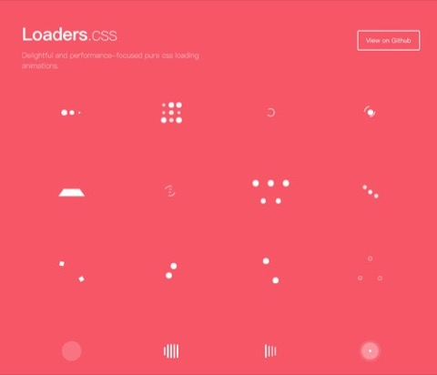
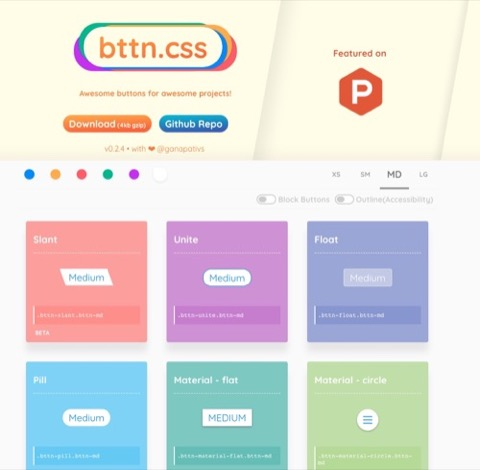
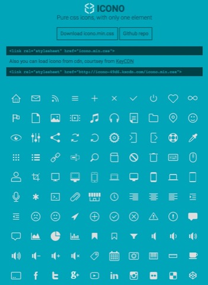

# web-assistant

记录一些好用的web项目工具，也有一些demo示例

## 示例DEMO

* 页面切换css主题
* H5视频直播

## Web项目常用库

### balloon.css

提示文字类

- GH: [https://github.com/kazzkiq/balloon.css](https://github.com/kazzkiq/balloon.css)
- DEMO: [https://kazzkiq.github.io/balloon.css/](https://kazzkiq.github.io/balloon.css/)

### loaders.css

加载动画

- GH: [https://github.com/ConnorAtherton/loaders.css](https://github.com/ConnorAtherton/loaders.css)
- DEMO: [https://connoratherton.com/loaders](https://connoratherton.com/loaders)

### bttn.css

按钮样式

- GH：[https://github.com/ganapativs/bttn.css](https://github.com/ganapativs/bttn.css)
- DEMO: [https://bttn.surge.sh/](https://bttn.surge.sh/)

### icono

纯css实现的图标，无需引用字体

- GH: [https://github.com/saeedalipoor/icono](https://github.com/saeedalipoor/icono)
- DEMO: [https://saeedalipoor.github.io/icono/](https://saeedalipoor.github.io/icono/)

